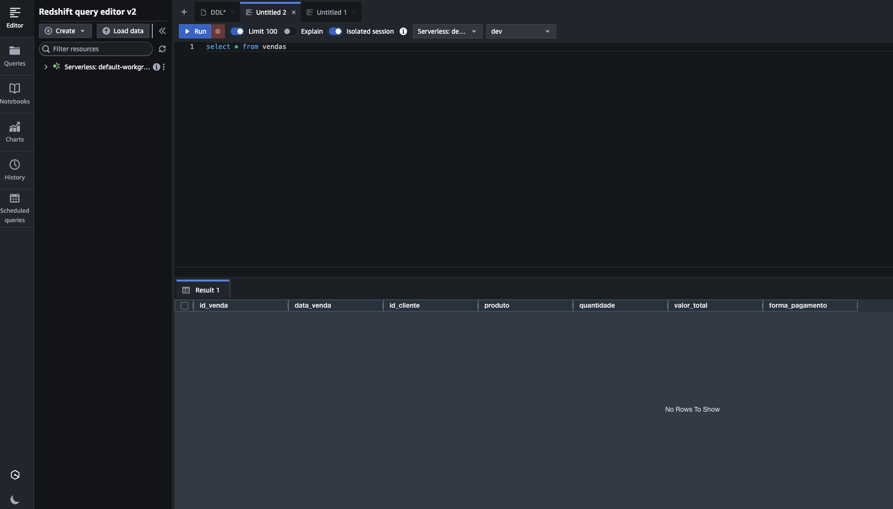
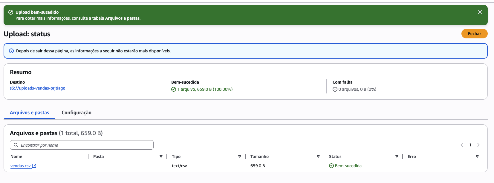
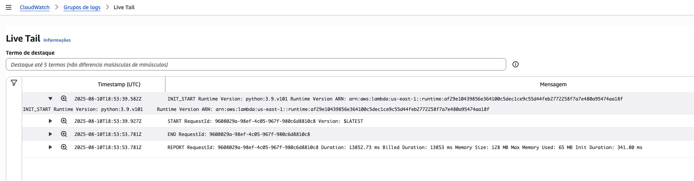
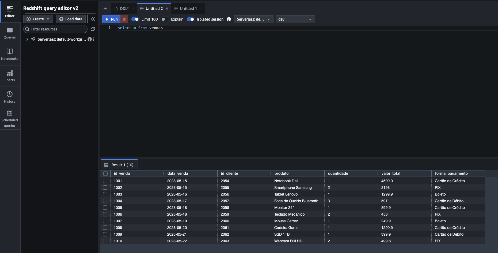

# ETL Project: Upload CSV from S3 to Redshift via Lambda

## Description

This project automates loading CSV data into Amazon Redshift. Whenever a CSV file is uploaded to an S3 bucket, an event triggers a Lambda function that imports the data into the `vendas` table in Redshift.

## How it works

1. User uploads a CSV file to the configured S3 bucket.
2. The S3 event triggers the Lambda function.
3. The Lambda connects to Redshift and executes a COPY command to load the CSV into the `vendas` table.
4. Data becomes immediately available for queries in Redshift.

## Redshift table structure

```sql
CREATE TABLE vendas (
    id_venda INTEGER PRIMARY KEY,
    data_venda DATE,
    id_cliente INTEGER,
    produto VARCHAR(100),
    quantidade INTEGER,
    valor_total DECIMAL(10, 2),
    forma_pagamento VARCHAR(50)
);
```

## Lambda code

- Connects to Redshift using environment variables for credentials (`REDSHIFT_DB`, `REDSHIFT_USER`, `REDSHIFT_PASSWORD`, `REDSHIFT_HOST`, `REDSHIFT_PORT`)
- Receives bucket name and file key from the S3 event
- Executes a COPY command to import the CSV, ignoring the header and using comma as delimiter
- Uses a specific IAM role for S3 access to Redshift (`arn:aws:iam::123456789:role/IAMRoleRedshift`)
- Updates your lambda code with "lambda_function.py" file

## Required setup

- S3 bucket configured to send events to Lambda on `.csv` file creation
- Lambda function created with permissions to access S3 and Redshift
- Environment variables set in Lambda: `REDSHIFT_DB`, `REDSHIFT_USER`, `REDSHIFT_PASSWORD`, `REDSHIFT_HOST`, `REDSHIFT_PORT`
- IAM role with permission `arn:aws:iam::123456789:role/NovaIAMRoleRedshift` attached to Redshift to allow reading files from S3
- Add a Lambda layer containing the `psycopg2` package (e.g., from `dependancies.zip`) and attach this layer to the Lambda function to enable Redshift connectivity  


## Results / Screenshots

### 1. Query on empty Redshift table


### 2. Upload of CSV file to S3


### 3. CloudWatch logs showing no errors


### 4. Redshift table with loaded data

